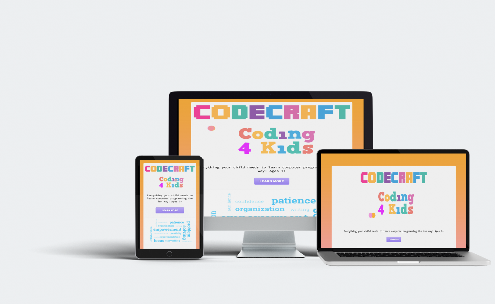

# Hello, this is Codecraft

The project idea was to create a coding platform specific for kids.  Opportunity to mix fun and learning.

Used Node and Express to generate the app; used Handlebars as template / view
engine and require a data file as the data source.  Github repo that
is also integrated with Heroku to host and deploy app (host on Heroku, manage it
on Github, continuously deploy it to Heroku).

## Tools used during development phase:
- Adobe Illustrator, Photoshop, After Effects
- SASS
- Node.js
- https://expressjs.com/ 
- https://handlebarsjs.com/ 
- https://www.heroku.com/ 
